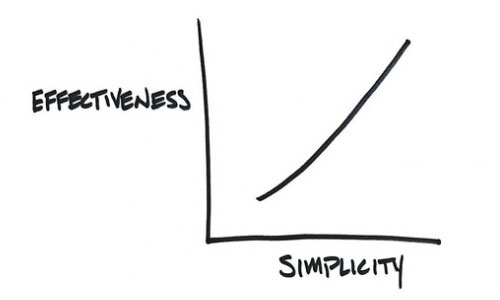
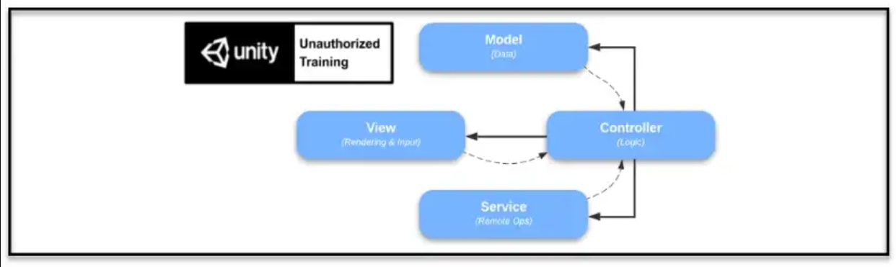

[](https://www.npmjs.com/package/com.rmc.rmc-mini-mvcs)
[](https://openupm.com/packages/com.rmc.rmc-mini-mvcs/)

[](https://opensource.org/licenses/MIT)

# Mini MVCS 

The Mini MVCS library for Unity is a custom framework embracing the [MVCS architecture](https://en.wikipedia.org/wiki/Model%E2%80%93view%E2%80%93controller).

MVCS is one of many solutions for organizing a Unity projec efficiently. It may or may not be the best solution for you.

## Mini MVCS Is Light

The Mini MVCS library is a **non-MonoBehaviour** solution for MVCS architecture within Unity. It has no dependencies on Unity libraries nor 3rd party libraries.

## Mini Is Free

The Mini MVCS library for Unity Development is free. Created by Rivello Multimedia Consulting.

## Mini Is Simple & Proven




## Mini is Flexible

It has few classes and a flexible pattern. Following the conventions of MVCS requires discipline as the system is purposefully light and flexible. For example the a model instance **can** access another model instance, but it is recommended not to do so.

## Mini Best Practices

### Communication

Mini is flexible and does not prevent actor-actor communication. However, best practices are to limit communication.

**Communication Channels**

* Methods - The caller scope has a reference to the called scope and "calls a method" in the typical sense. This is the most coupled communication channel
* Events - [Observer pattern](https://www.dofactory.com/net/observer-design-pattern) where the reciever **has** a reference to the sender
* Commands - [Observer pattern](https://www.dofactory.com/net/observer-design-pattern) where the reciever **has no** reference to the sender. This is the least coupled communication channel

**Communication Suggestions**

| --              | To Model     | To View                 | To Controller | To Service     |
|-----------------|--------------|-------------------------|---------------|----------------|
| From Model      | ❌           | ❌                     | ✔️(Events)    | ❌           |
| From View       | ❌           | ❌                     | ✔️(Events)    | ❌           |
| From Controller | ✔️(Methods)  | ✔️(Methods/Commands)  | ✔️(Commands)  | ✔️(Methods)  |
| From Service    | ❌           | ❌                    | ✔️(Events)    | ❌           |

**Communication Diagram**




## Mini Appropriateness

MVCS is one of many solutions for organizing a Unity projec efficiently. It may or may not be the best solution for you.


| MVCS Pros                         | MVCS Cons     |
|-----------------------------------|---------------|
| Code is highly maintainable       | Code is highly repetitive                                   | 
| Code is highly extensible         | Project navigation requires more time                       | 
| Faster to update an existing project    | Slower To start a new project                         | 
| Adding a new feature is prescriptive          | Adding a new feature may require more classes     | 
| Faster learning curve to onboard veterans     | Slower learning curve to onboard newbies          | 
| Suggested for projects of medium/large scope  | Not Suggested for projects of small scope         | 
| Model is highly testable (TDD)                |                                                  | 
| Coding invites less debate                   | Coding requires more discipline                  | 

**Appropriateness For Games**

For projects where runtime optimization is essential, coding directly (without MVCS), may yield better performance.

However, that is likely a subsection of a game. The rest of the game may still benefit from MVCS. There is indeed flexibility for such a hybrid solution.


# Table Of Contents

- [How to use](#how-to-use)
- [Install](#install)
  - [via npm](#via-npm)
  - [via OpenUPM](#via-openupm)
  - [via Git URL](#via-git-url)
  - [Tests](#tests)
- [Configuration](#configuration)

<!-- toc -->

## How to use

*Work In Progress* 

**Use only the "via Git URL" below**

## Install

### via npm

Open `Packages/manifest.json` with your favorite text editor. Add a [scoped registry](https://docs.unity3d.com/Manual/upm-scoped.html) and following line to dependencies block:
```json
{
  "scopedRegistries": [
    {
      "name": "npmjs",
      "url": "https://registry.npmjs.org/",
      "scopes": [
        "com.rmc.mini-mvcs"
      ]
    }
  ],
  "dependencies": {
    "com.rmc.rmc-mini-mvcs": "1.0.0"
  }
}
```
Package should now appear in package manager.

### via OpenUPM

The package is also available on the [openupm registry](https://openupm.com/packages/com.rmc.rmc-mini-mvcs). You can install it eg. via [openupm-cli](https://github.com/openupm/openupm-cli).

```
openupm add com.rmc.rmc-mini-mvcs
```

### via Git URL

Open `Packages/manifest.json` with your favorite text editor. Add following line to the dependencies block:
```json
{
  "dependencies": {
    "com.rmc.rmc-mini-mvcs": "https://github.com/SamuelAsherRivello/rmc-mini-mvcs.git"
  }
}
```

### Tests

The package can optionally be set as *testable*.
In practice this means that tests in the package will be visible in the [Unity Test Runner](https://docs.unity3d.com/2017.4/Documentation/Manual/testing-editortestsrunner.html).

Open `Packages/manifest.json` with your favorite text editor. Add following line **after** the dependencies block:
```json
{
  "dependencies": {
  },
  "testables": [ "com.rmc.rmc-mini-mvcs" ]
}
```

## Configuration

*Work In Progress*

## License

MIT License

Copyright © 2022 rmc


Created By
=============

- Samuel Asher Rivello 
- Over 23 years XP with game development (2023)
- Over 10 years XP with Unity (2023)

Contact
=============

- Twitter - <a href="https://twitter.com/srivello/">@srivello</a>
- Resume & Portfolio - <a href="http://www.SamuelAsherRivello.com">SamuelAsherRivello.com</a>
- Git - <a href="https://github.com/SamuelAsherRivello/">Github.com/SamuelAsherRivello</a>
- LinkedIn - <a href="https://Linkedin.com/in/SamuelAsherRivello">Linkedin.com/in/SamuelAsherRivello</a> <--- Say Hello! :)


